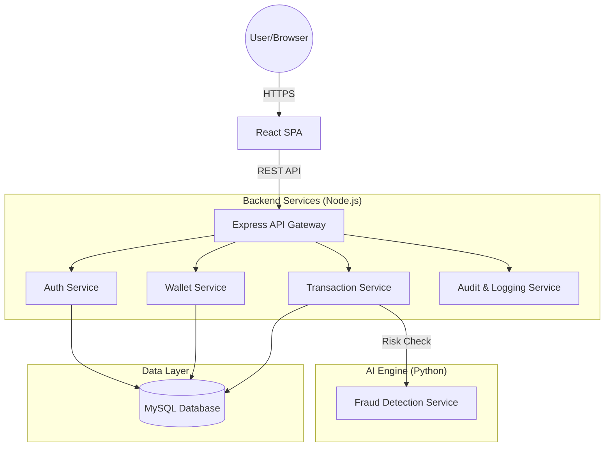

# AI-Powered Secure Digital Wallet System (v2.0)
## Enterprise-Grade Digital Payments with Real-Time Fraud Detection

**Author:** [Your Name]  
**Project Type:** Final Year Project / Fintech Portfolio  
**Stack:** React, Node.js, MySQL, Python (Scikit-Learn)

---

## 1. Executive Summary
The **AI-Powered Secure Digital Wallet System** is a full-stack fintech platform designed to simulate modern payment processors like Stripe or PayPal. It provides a secure environment for peer-to-peer (P2P) transfers, featuring a multi-layered security architecture and a dedicated Machine Learning service that analyzes transaction patterns in real-time to prevent fraudulent activity.

---

## 2. System Architecture
The system follows a **Modular Monolith Architecture** with specialized services for high-risk operations.

### 2.1 High-Level Overview


### 2.2 Service Communication
- **Internal Services:** Communication via shared database and function calls within the modular backend.
- **AI Integration:** The Transaction Service communicates with the Python Flask AI service over **HTTP/JSON** to receive real-time risk scores (0.0 to 1.0) before finalizing transfers.

---

## 3. Technical Stack
| Layer | Technology |
| :--- | :--- |
| **Frontend** | React 18, Vite, Recharts (Analytics), Axios, QR Code Generation |
| **Backend** | Node.js, Express.js, JWT, Bcrypt, Winston (Logging), Helmet (Security) |
| **AI/ML** | Python 3.9, Flask, Scikit-Learn (Random Forest), Pandas, NumPy |
| **Database** | MySQL 8.0 (Relational Schema with Audit Logs) |
| **DevOps** | Dotenv (Environment Management), Morgan (HTTP Request Logging) |

---

## 4. Key Features

### 4.1 For Consumers
- **Secure Wallet:** Real-time balance updates and currency formatting.
- **Smart P2P Transfers:** Instant money transfer via email with automatic limit checks.
- **QR Payment Support:** Generate and scan unique wallet QR codes for contactless payments.
- **Personal Analytics:** Visualize spending habits and transaction history.
- **Instant Notifications:** Receive feedback on transaction success or risk flags.

### 4.2 For Administrators
- **Real-Time Analytics:** Interactive charts for system-wide volume and user growth.
- **Fraud Investigation Panel:** Deep-dive into transactions flagged by the AI engine.
- **Audit Trails:** Comprehensive logs of every sensitive system action (Logins, Transfers, Failures).
- **User Management:** Overview of all registered users and their wallet statuses.

---

## 5. Security & Risk Management
In fintech, security is the primary product. This system implements:

### 5.1 Authentication & Authorization
- **JWT (JSON Web Tokens):** Stateless authentication with secure local storage handling.
- **Bcrypt Hashing:** Passwords are never stored in plain text; salted and hashed with 10 rounds.
- **RBAC (Role-Based Access Control):** Granular permissions for `User` and `Admin` roles.

### 5.2 Infrastructure Security
- **Rate Limiting:** Prevents brute-force attacks by limiting IPs to 100 requests per 15 minutes.
- **Helmet.js:** Secures HTTP headers against common vulnerabilities (XSS, Clickjacking).
- **CORS:** Restricts API access to authorized frontend domains.

### 5.3 Transaction Guardrails
- **Daily Limits:** Hard-coded and per-user configurable limits ($5,000 daily max).
- **Single-Transaction Limits:** Blocks any single transfer exceeding $2,000.
- **Transaction PIN (Optional/Planned):** Secondary verification for high-value transfers.

---

## 6. AI Fraud Detection Model
The system uses a **Random Forest Classifier** to evaluate risk. Unlike simple rule-based systems, it analyzes the relationship between features.

### 6.1 Model Features
- `transaction_amount`: Larger amounts contribute to higher risk scores.
- `hour_of_day`: Late-night transactions (11 PM - 4 AM) increase suspicion.
- `sender_balance`: Drastic balance depletion triggers higher fraud probability.

### 6.2 Scoring Logic
- **Score < 0.3:** Low Risk (Green) - Processed immediately.
- **0.3 ≤ Score < 0.8:** Medium/High Risk (Orange) - Processed but flagged in Admin Panel.
- **Score ≥ 0.8:** Critical Risk (Red) - Processed but triggers immediate fraud alert and high-risk status.

---

## 7. Database Architecture
The schema is normalized to ensure data integrity and auditability.

- **Users:** Core identity data.
- **Wallets:** Financial state (Balance, Tier).
- **Transactions:** The immutable ledger of all money movements.
- **Audit_Logs:** Forensic trail of system activity (IP address, Timestamp, Action).
- **Fraud_Alerts:** Historical record of AI-detected suspicious activities.

---

## 8. Installation & Deployment

### 1. Requirements
- Node.js v16+
- Python v3.9+
- MySQL v8.0

### 2. Setup
1. **Database:** Import `database/schema.sql` into MySQL.
2. **Backend:** 
   ```bash
   cd backend && npm install && npm start
   ```
3. **AI Service:** 
   ```bash
   cd ai-service && pip install -r requirements.txt && python app.py
   ```
4. **Frontend:** 
   ```bash
   cd frontend && npm install && npm run dev
   ```

---

## 9. Future Roadmap
- **Microservices Migration:** Separating services into Docker containers (Kubernetes ready).
- **Blockchain Ledger:** Implementing a private blockchain for an immutable transaction hash chain.
- **Biometric Auth:** Integrating Fingerprint/FaceID via WebAuthn API.
- **Mobile App:** Developing a Flutter/React Native companion app for QR scanning.

---
© 2026 SecureWallet Platform. All Rights Reserved.
